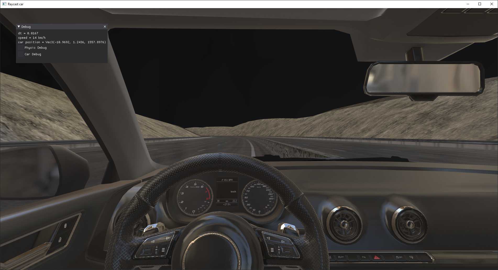
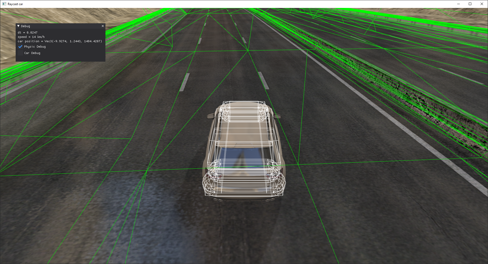
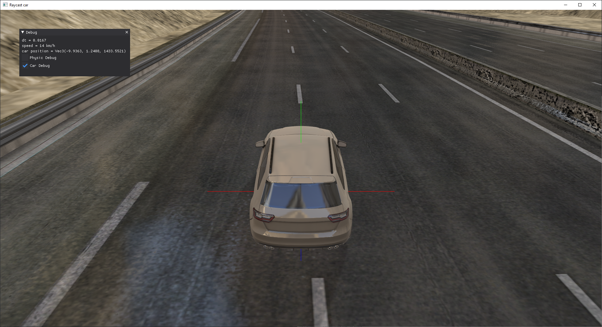
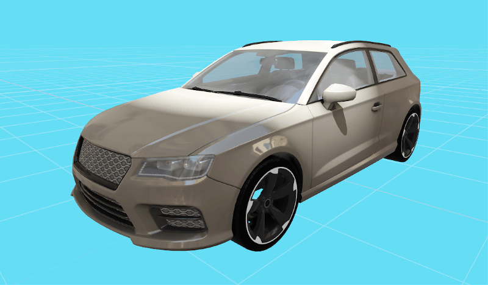
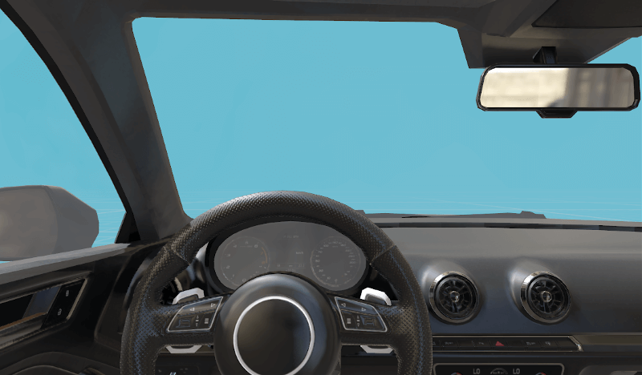
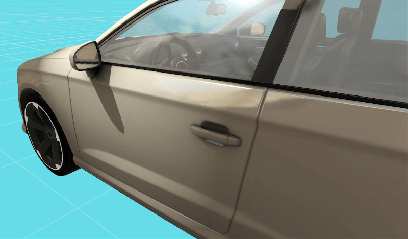

## Car Simulator - VR & 3D - Raycast Car | Made with Harfang 3D

* Implemented in Python
* VR Support (using [Harfang 3D OpenVR Support](https://partner.steamgames.com/doc/features/steamvr/openvr?l=french))
* Raycast Car (using [Bullet Physics](https://github.com/bulletphysics/bullet3))
* Built on [Harfang 3D](https://github.com/harfang3d/harfang3d)
* **W.I.P**

### Running the simulator

This **prototype** demonstrates the usage of Raycast Car Mechanics (suspension, braking, accelerating, collisions etc...) using the HARFANG API in **Python**.

To run the prototype:

1. Download or clone this repository to your computer _(eg. in `C:/car-simulator`)_.
2. Make sure _Python_ 3.2 or higher is installed on your computer with the Harfang 3D wheel [Harfang PyPi Project](https://pypi.org/project/harfang/)
3. Download _assetc_ for your platform from [here](https://harfang3d.com/releases) to compile the resources.
4. Extract _assetc_ to the correct folder _(eg. `c:/car-simulator/app/bin/harfang/assetc`)_, the path should already be here, all you have to do is extract the assetc files into this folder.
5. Run **1-build_assets.bat**.
6. Run **2-run.bat** or **3-run_vr.bat**.

### Screenshots of the actual version

 
 
 

### Tasks done so far
- [x] Implement a basic Raycast Car
- [x] Add a VR version
- [x] Make the car controlable with a steering wheel and pedals
- [x] Regroup the VR and normal version inside the same file
- [x] Implement a road
- [x] Test mesh collisions for turning roads
- [x] Add a GUI
- [x] Add a speed'o'meter
- [x] Add a car and physics debug feature
- [x] Create a tool to convert .nms tracks to JSON
- [x] Other cars moving around
- [x] Add a SkyBox
- [ ] Fix physics imprecision problems
- [ ] Fix render triangles imprecision problems
- [ ] Real road with a side environment

### First version of the Raycast Car

### Generic Car Model

 
 
 
